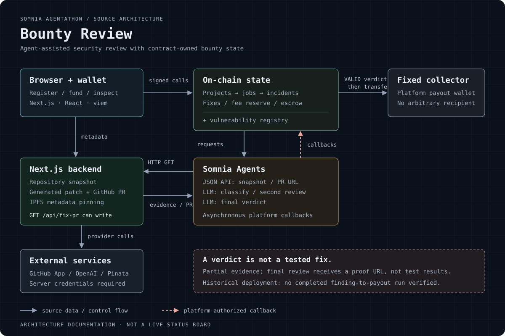

# Bounty Review

A Somnia hackathon prototype that coordinates agent-assisted Solidity security review, GitHub pull requests and bounty escrow through an on-chain state machine.

Built for the Somnia Agentathon under the original name **SomniBounty AI**. This is **not a production audit system**. Local contract tests pass, but a complete live finding-to-payout run has not been verified at the documented deployment.



[Engineering](docs/engineering.md) · [Verification and limits](docs/evidence.md) · [Local setup](docs/local-development.md)

## What the code implements

A publisher registers a repository and funds severity-based bounty tiers. The contract requests a repository snapshot, an LLM classification and a second review. A valid candidate opens an incident and requests a GitHub PR through the backend. A final agent verdict gates payment to a fixed platform collector.

The engineering focus is the boundary between asynchronous external work and contract-owned state: callback authentication, request bookkeeping, fee reserves, incident transitions and payout routing. The Next.js backend holds GitHub App, OpenAI and IPFS credentials; the contract accepts verdicts from its configured agent platform.

**Stack:** Solidity / Foundry, Next.js / React / TypeScript, viem, Somnia Agents, GitHub App, OpenAI and Pinata.

## Current evidence

- 21 contract tests pass against a mock agent platform. Web build, lint and TypeScript checks pass locally.
- The documented Somnia testnet address reports two projects and two scan jobs, with zero incidents and zero fixes at the recorded inspection block.
- Deployed bytecode does not match the current local build. Source-to-deployment parity remains unverified.
- The former hosted service timed out during inspection. There is no verified public demo linked here.
- The published dependency lockfile has known vulnerabilities. Updates were deliberately excluded from this presentation pass.

The [evidence note](docs/evidence.md) records the revision, block, contract addresses, checks and dependency findings. The diagram shows source architecture, not a successfully completed live run.

## Run the checks

```bash
node --test scripts/test-presentation.mjs
cd smart_contract && forge test
```

For the web app, start in `apps/web` and run `npm ci`, `npm run lint`, `npx tsc --noEmit` and `npm run build`. Use the [local setup guide](docs/local-development.md) for a loopback-only preview without provider secrets. Live scripts can sign transactions or create external resources; they are not smoke tests.

## Names and history

`SomniBountyAI` contract names, ABI symbols, environment variables, IPFS schemas, generated PR paths and recorded deployment identities remain unchanged. Bounty Review is the repository and user-facing name; this rename does not deploy a new contract or migrate state.

[Original hackathon README](https://github.com/SourceSenseiTheRealOne/bounty-review/blob/3d275bf80483a24f3594921f18497837b6ef937d/README.md)
